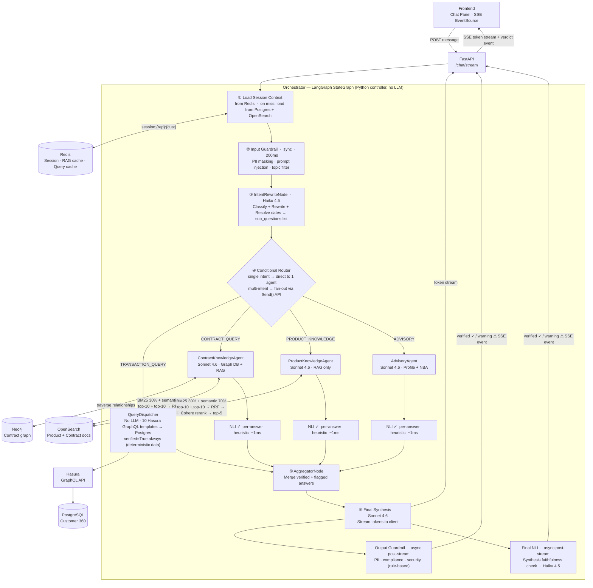

# AI FrontLine Agent — System Architecture

## Overview

AI FrontLine Agent is a bank CRM AI system that gives sales representatives an AI-powered assistant to help them understand customers, query data, and generate sales recommendations. The UI has two panels: a **chat panel (left)** where the rep interacts with the AI agent, and a **customer 360 panel (right)** showing structured customer information loaded at session start.

---

## Tech Stack

| Layer | Technology | Purpose |
|---|---|---|
| Frontend | HTML + Vanilla JS | Two-panel UI: chat + customer 360 |
| Backend | Python / FastAPI | Thin HTTP layer: auth, SSE streaming, request validation only |
| Agent Framework | LangGraph | Multi-agent orchestration, state management, conditional routing |
| GraphQL API | Hasura | Auto-generated GraphQL over PostgreSQL; row-level security for rep portfolio access |
| LLM (Reasoning) | Claude Sonnet 4.6 — Anthropic API | Contract reasoning, product knowledge, advisory, final synthesis |
| LLM (Routing) | Claude Haiku 4.5 — Anthropic API | Intent classification + query rewrite (single call, fast) |
| LLM (NLI) | Claude Haiku 4.5 — Anthropic API | Final NLI faithfulness check only (Layer 4) |
| Embedding | Cohere embed-multilingual-v3 — Cohere API | Document and query embedding (Vietnamese + English) |
| Reranker | Cohere rerank-multilingual-v3.0 — Cohere API | Cross-lingual semantic reranking after RRF merge |
| Structured DB | PostgreSQL | Customer 360 data, transactions, products, long-term memory |
| Vector DB | OpenSearch | Product documents, contract clauses, RAG retrieval, conversation summaries |
| Graph DB | Neo4j | Customer contract entity relationships |
| Cache | Redis | Session context, query results, contract data, RAG results |
| Observability | LangSmith | Full trace tree: RAG spans, Hasura spans, NLI spans, per-request traces |
| Data Source | Data Lake | Source of truth feeding all downstream databases |

---

## System Components

### 1. Frontend — HTML + Vanilla JS

Two-panel layout served as a static page:

- **Left — Chat Panel:** Rep types natural language questions. Responses stream token-by-token via the browser's native `EventSource` API (SSE). A verified (`✓`) or warning (`⚠`) indicator appears after the async post-stream checks complete.
- **Right — Customer 360 Panel:** Loaded at session start via `GET /api/customers/{id}`. Displays customer name, demographics, KYC status, credit score, segment, product portfolio (CASA, loans, term deposits, credit cards, bancassurance contracts), recent transaction summary, open support cases, and insurance contract dates.

---

### 2. Backend — FastAPI (Thin HTTP Layer)

FastAPI is a **thin HTTP layer only** — it does not load memory, assemble context, or execute business logic. All of that belongs to the Orchestrator.

**Key endpoints:**

| Endpoint | What FastAPI Does | What Happens Next |
|---|---|---|
| `POST /api/sessions/start` | Validate JWT, generate `session_id`, return it | Orchestrator initializes on first `/chat/stream` call |
| `POST /api/sessions/end` | Validate JWT, forward `session_id` to Orchestrator | Orchestrator summarizes + writes long-term memory |
| `POST /api/chat/stream` | Validate JWT + Pydantic envelope, invoke Orchestrator | Returns SSE token stream |
| `GET /api/customers/{id}` | Validate JWT + portfolio access, query Hasura | Customer 360 JSON for right panel |
| `GET /api/health` | Liveness check | — |

**Pydantic** validates the structured request envelope (`session_id`, `customer_id`, `message`). The NL message content itself is not validated — it flows to the Orchestrator as-is.

---

### 3. Authentication & Authorization

- JWT validation on every request as FastAPI middleware — runs before the Orchestrator is reached
- A sales rep can only access customers in their assigned portfolio
- Portfolio access enforced at two points: FastAPI middleware (customer 360 endpoint) and Hasura row-level permissions (all GraphQL queries)

---

### 4. GraphQL API — Hasura

Hasura sits between the QueryDispatcher and PostgreSQL. It auto-generates a GraphQL API from the PostgreSQL schema and enforces row-level security.

**Why Hasura over raw SQL or a custom GraphQL server:**
- Row-level permission rules map directly to rep portfolio access — no custom auth code needed
- QueryDispatcher uses pre-built named query templates; Hasura handles query execution and connection pooling
- Admin console for schema inspection without writing boilerplate

**Permission model:** Every GraphQL query from the QueryDispatcher carries the rep's JWT. Hasura validates it and applies the row filter `WHERE rep_id = JWT.sub` transparently before hitting PostgreSQL.

---

### 5. Orchestrator — LangGraph StateGraph

The Orchestrator **is** the LangGraph `StateGraph` — a Python execution controller with **no LLM calls of its own**. It is not an agent. It:

- Owns session initialization: loads long-term memory and assembles the system prompt on first message
- Manages the LangGraph node execution order
- Handles conditional routing (single intent → direct, multi-intent → fan-out via LangGraph `Send()` API)
- Collects sub-agent outputs and drives final synthesis
- Pipes the async token generator back to FastAPI as SSE
- Creates a fresh `LangChainTracer` per request for multi-turn LangSmith tracing

**Mental model:**

| Thing | Role | Makes LLM calls? |
|---|---|---|
| Orchestrator | Traffic controller — routes, coordinates, pipes tokens | No |
| IntentRewriteNode | Classifier — classifies, rewrites, resolves dates | Yes (Haiku) |
| Knowledge Agents | Reasoners — retrieve and reason | Yes (Sonnet) |
| QueryDispatcher | Executor — maps to template, executes deterministically | No |

---

### 6. Agent Pipeline — LangGraph Nodes



---

#### Node 1: IntentRewriteNode (Haiku 4.5)

A **single LLM call** that performs both classification and rewriting simultaneously.

**Jobs:**
1. **Intent Classification** — detect which agent categories apply: `TRANSACTION_QUERY`, `CONTRACT_QUERY`, `PRODUCT_KNOWLEDGE`, `ADVISORY`
2. **Query Rewrite** — resolve vague references ("this customer" → `CUST_001`), resolve relative dates ("last 3 months" → concrete `date_from`/`date_to`), split multi-intent questions into atomic sub-questions each routable to exactly one agent

**Output (`sub_questions` list in AgentState):**
```json
[
  {
    "id": "sq1",
    "intent": "TRANSACTION_QUERY",
    "agent": "query_dispatcher",
    "query_type": "aggregate_by_merchant",
    "params": {
      "customer_id": "CUST-001",
      "merchant_name": "booking.com",
      "date_from": "2026-03-21",
      "date_to": "2026-06-21"
    },
    "rewritten_query": "Khách hàng CUST-001 có giao dịch với booking.com trong 3 tháng qua không?"
  }
]
```

If the list has 1 item → Conditional Router sends directly to that agent. If multiple items → fan-out in parallel via LangGraph `Send()`.

> **Implementation note:** system prompt uses `.replace("{today}", today)` — not `.format()` — to avoid `KeyError` on the JSON curly braces inside the prompt template.

---

#### Node 2: Conditional Router

Pure Python LangGraph edge (`_fan_out`). Reads `sub_questions` from state:

- Iterates sub-questions, injects per-branch `query_type`, `query_params`, and `rewritten_query` into a copy of the state
- Dispatches each branch via `Send(node_name, branch_state)` in parallel
- Falls back to `"aggregator"` directly if `sub_questions` is empty

---

#### Node 3: QueryDispatcher — No LLM

Handles all `TRANSACTION_QUERY` and structured profile queries. Pure Python — no LLM involved.

Maps `query_type` to one of **10 pre-built named GraphQL templates**, executes via Hasura against PostgreSQL. All date parameters are converted from `YYYY-MM-DD` to `timestamptz` format (`YYYY-MM-DDT00:00:00`) before passing to Hasura.

**Result:** `verified=True` always — deterministic Postgres data carries no hallucination risk.

**Query templates (10 total):**

| `query_type` | What it returns | Date params |
|---|---|---|
| `profile_demographics` | Income range, occupation, KYC, credit score, loyalty points | No |
| `product_portfolio_summary` | Products held + all contracts | No |
| `aggregate_by_category` | Spend totals grouped by merchant category | Yes |
| `aggregate_by_merchant` | Transactions by merchant name (`_ilike`) or category | Yes |
| `transaction_count_by_period` | Count of transactions in date range | Yes |
| `casa_balance_summary` | CASA + savings account balances | No |
| `loan_balance_remaining` | Active loans: outstanding balance, monthly payment | No |
| `term_deposit_list` | Term deposits: principal, rate, maturity | No |
| `insurance_contract_status` | Insurance contracts: status, dates, key amount | No |
| `segment_gap_analysis` | Derived from state — no Hasura call | No |

`aggregate_by_merchant` dispatches to one of two sub-queries depending on params:
- **By name** (e.g. "booking.com"): `merchant_name: {_ilike: "%booking.com%"}`
- **By category** (e.g. "F&B"): `merchant_category: {_eq: "F&B"}`

> **No NL2SQL fallback** — unrecognised `query_type` values return an unsupported message. NL2SQL is a future enhancement.

---

#### Node 4: ContractKnowledgeAgent (Sonnet 4.6)

Handles `CONTRACT_QUERY` — questions requiring reasoning over the customer's signed contracts.

**Steps:**
1. Check Redis for cached contract data (`contract:{customer_id}`, TTL 6h)
2. On miss: traverse Neo4j — `Customer -[HAS]-> Contract -[IS_TYPE]-> Policy -[HAS_CLAUSE]-> Clause`
3. Write Graph DB result to Redis cache
4. Check Redis semantic cache for RAG result (`rag:{query_hash}`, TTL 6h)
5. On miss: hybrid RAG on OpenSearch — BM25 (30%) + semantic (70%) → top-10 each → RRF merge → Cohere rerank (`rerank-multilingual-v3.0`) → **top-5 chunks**
6. Write RAG result to Redis cache
7. Send contract graph context + top-5 chunks to Sonnet for reasoning
8. Per-answer NLI check (heuristic) → return to Aggregator

**Data boundary:**
- **Neo4j:** contract metadata and entity relationships (contract ID, type, status, parties, clause references)
- **OpenSearch:** full clause text and policy documents (linked to Neo4j nodes by `contract_id`)

---

#### Node 5: ProductKnowledgeAgent (Sonnet 4.6)

Handles `PRODUCT_KNOWLEDGE` — general product information queries (T&Cs, rates, promotions, eligibility).

**Steps:**
1. Check Redis semantic cache for RAG result (`rag:{query_hash}`, TTL 6h)
2. On miss: hybrid RAG on OpenSearch — BM25 (30%) + semantic (70%) → top-10 each → RRF merge → Cohere rerank → **top-5 chunks** + sibling expansion
3. Write RAG result to Redis cache
4. Send top-5 chunks to Sonnet for reasoning
5. Per-answer NLI check (heuristic) → return to Aggregator

**Why 30/70 BM25/semantic split for Vietnamese:** BM25 does exact token matching — Vietnamese compound words and tone marks cause tokenization mismatches. Semantic embedding handles morphological variation naturally. BM25 at 30% still handles exact product codes, clause numbers, and English terms embedded in Vietnamese text (e.g., "KYC", "APE", "L/C").

---

#### Node 6: AdvisoryAgent (Sonnet 4.6)

Handles `ADVISORY` — sales script generation and product recommendations.

Uses customer profile (from session context), transaction behavior, conversation history, and NBA/NBO rule-based scoring on segment gap and product portfolio gaps. Generates tailored talking points and sales scripts grounded in actual customer data.

Per-answer NLI check (heuristic) ensures the script does not reference facts not present in the customer's profile or conversation history.

---

#### Node 7: AggregatorNode

Collects all validated sub-answers from all branches. If a sub-answer failed NLI, it is included with an uncertainty flag rather than dropped — the Aggregator tells Sonnet which answers are verified and which are uncertain. Merges everything into one context block for final synthesis.

---

#### Node 8: Final Synthesis (Sonnet 4.6)

Receives the merged context block from the Aggregator. Generates a single cohesive, natural language response in Vietnamese. Streams tokens via FastAPI async generator → SSE to frontend.

---

#### Node 9: Safety Checks — 4 Layers

| # | Check | Model | Timing | Purpose |
|---|---|---|---|---|
| 1 | **Input Guardrail** | Rule-based regex | Sync, pre-pipeline, ~200ms | Prompt injection, PII masking in query, off-topic filter |
| 2 | **Per-agent NLI** | Heuristic (~1ms, zero token cost) | Sync, inside each RAG agent | Term overlap (>20%) + number grounding between answer and retrieved chunks — primary hallucination defence |
| 3 | **Output Guardrail** | Rule-based regex | Async, post-stream | PII patterns in final response, prohibited compliance phrases |
| 4 | **Final NLI** | Haiku 4.5 | Async, post-stream | Synthesized answer vs aggregated sub-answers — catches hallucinations added during Sonnet synthesis step |

> **Layer 2 detail:** `nli_checker.py` uses heuristic checks only — no LLM call. Key term overlap between the answer and all retrieved chunks must exceed 20%; any number >3 digits in the answer must appear in at least one chunk. Production upgrade path: swap for `mDeBERTa-v3-base-mnli-xnli` when PyTorch ≥ 2.4 is confirmed stable.

> **QueryDispatcher skips NLI** — data comes directly from Postgres via deterministic GraphQL; `verified=True` is set unconditionally.

**Streaming strategy:** Stream tokens to client immediately → Output Guardrail and Final NLI run in parallel on the buffered complete response → send `{type: "verified" | "warning"}` SSE verdict event.

---

### 7. Data Layer

#### PostgreSQL — Customer 360

Structured customer data: demographics, KYC, credit score, segment, product portfolio (CASA accounts, loans, credit cards, term deposits, bancassurance), transaction history, open support cases, long-term memory records (behavior profile, product offer history, life event timeline).

Accessed via Hasura GraphQL by: QueryDispatcher, session context loader (Orchestrator node ①), customer 360 right panel.

#### OpenSearch — Product & Contract Documents

Unstructured and semi-structured content indexed for hybrid retrieval:
- Product descriptions, T&Cs, pricing policies, promotion campaigns
- Contract clause text (linked to Neo4j nodes by `contract_id`)
- Conversation summaries (long-term memory vector store)
- Customer behavior profiles (semantic retrieval)

#### Neo4j — Contract Graph

Customer contract entity relationships:
```
Customer -[HAS]-> Contract -[IS_TYPE]-> BancaInsurance
Contract -[HAS_CLAUSE]-> Clause
Contract -[LINKED_TO]-> Product
```

Stores: contract metadata, status, parties, clause references. Full clause text lives in OpenSearch.

#### Redis — Cache

Four namespaces. Agents never call Redis directly — all cache reads/writes go through the Orchestrator node or dedicated cache layer.

| Namespace | Key Pattern | TTL | Invalidation |
|---|---|---|---|
| Session context | `session:{session_id}` | 4h | Session end |
| Query results | `query:{customer_id}:{query_type}:{params_hash}` | 30min–24h (tiered) | Write-through + TTL |
| Contract data | `contract:{customer_id}` | 6h | `CONTRACT_UPDATED` event from Data Lake |
| RAG results | `rag:{query_hash}` | 6h | Document ingestion event |

**Tiered TTL by data change frequency:**

| Data Type | TTL |
|---|---|
| Customer demographics | 24h |
| Product portfolio | 24h |
| Loan / term deposit balance | 6h |
| Insurance contracts | 6h |
| Transaction aggregations | 30min |
| RAG / product documents | 6h + ingestion event |
| Session context | Session duration (max 4h) |

---

### 8. RAG Pipeline

#### Ingestion (Offline)
```
Markdown documents  (data/documents/**/*.md)
  → Stage 1: Split on ## / ### headings (MarkdownHeaderTextSplitter)
  → Stage 2: RecursiveCharacterTextSplitter if section > 400 tokens
             chunk_size=400 tokens, overlap=80 tokens (~20%)
  → Continuation sub-chunks prepend section heading (e.g. "### 2.1 Ba Quỹ Liên Kết")
    so each chunk is semantically self-contained for retrieval
  → Cohere embed-multilingual-v3 (batch embedding, input_type="search_document")
  → OpenSearch index "product-docs" with metadata:
      { doc_id, product_category, product_name, h2_section, h3_section,
        chunk_index, token_count, source_file }
```

#### Retrieval (Online, per agent query)
```
Step 1 — Parallel hybrid search:
  BM25 keyword search     → top-10 chunks  (weight 0.3 in RRF)
  Cohere KNN vector search → top-10 chunks  (weight 0.7 in RRF)
  RRF merge: score = 0.3 × 1/(rank_bm25+60) + 0.7 × 1/(rank_sem+60)
  → ~12–18 unique candidates

Step 2 — Cohere rerank:
  rerank-multilingual-v3.0 rescores candidates against the original query
  Returns top-5 most relevant chunks

Step 3 — Sibling chunk expansion:
  For each top-5 chunk, fetch chunk_index+1 if it shares the same h3_section
  Fixes split sections where a continuation chunk lacks the section heading
  (e.g. Banca fund descriptions split across two chunks)

Step 4 — Context assembly:
  Final chunks + source citations → LLM prompt
```

**Why top-10 per modality:** BM25 and semantic search have significant result overlap — fetching 10 each yields ~12–18 unique chunks after RRF, sufficient for Cohere rerank to select top-5. Increasing to 20 doubles reranker API cost with negligible recall improvement.

**Why Cohere API reranker (not local cross-encoder):** Vietnamese + English multilingual support out of the box; no GPU/model management; `rerank-multilingual-v3.0` outperforms local cross-encoders on Vietnamese banking text in testing.

---

### 9. Observability — LangSmith

Every request creates one trace in LangSmith under the project `ai-frontline-agent`. A fresh `LangChainTracer` is instantiated per request (not a singleton) to ensure multi-turn conversations produce separate, correctly-labelled traces.

**Span tree per request:**
```
chat:{customer_id}                        ← root run
└── LangGraph
    ├── _product_agent (or other agent)
    │   ├── RAG·BM25          retriever  — query, total hits, chunk previews
    │   ├── RAG·KNN           retriever  — query, total hits, chunk previews
    │   ├── RAG·RRF_Merge     chain      — bm25_count, knn_count, merged_count
    │   ├── RAG·Cohere_Rerank chain      — relevance scores per chunk
    │   ├── RAG·Sibling_Expansion chain  — added chunk IDs
    │   └── NLI·PerAgent      chain      — agent, overlap_pct, verified, warning
    ├── _query_dispatcher
    │   └── QueryDispatcher·Hasura tool  — query_type, variables_sent, rows_returned
    └── aggregator
        ├── NLI·OutputGuardrail chain    — passed, triggered_rule (pii/compliance label)
        └── NLI·Final          chain     — consistent, issues (Haiku input/output)
```

**Implementation notes:**
- RAG `@traceable` log functions are called in the **async event loop** (after `run_in_executor` returns), not inside the thread — this ensures they inherit the active LangSmith run-tree context and appear as child spans
- `NLI·Final` is applied directly to the async `check()` function
- Hasura client logs query name + variables at `INFO` level to stdout in addition to LangSmith

---

### 10. Evaluation Dataset

RAGAS evaluation requires a **golden dataset** — without it, evaluation scores are meaningless. This must be built before any offline evaluation run.

#### Dataset Composition (~300–400 examples total)

| Type | Volume | Source |
|---|---|---|
| Product knowledge Q&A | ~200 examples (10–15 per product × 15 products) | LLM-draft from product documents → human review |
| Contract clause reasoning | ~50 examples | Hand-crafted from known clause scenarios |
| Structured query (QueryDispatcher) | ~50 examples | Sampled from seed data; query + expected template + expected result |
| Adversarial / edge cases | ~30 examples | Cross-product confusion; ambiguous pronouns; out-of-scope questions |

**Format (JSONL):**
```json
{
  "question": "Khách hàng này có đủ điều kiện hưởng quyền lợi y tế khẩn cấp khi đi nước ngoài không?",
  "ground_truth": "Có, vì hợp đồng đã duy trì liên tục 14 tháng và khách hàng đang ở phân khúc Platinum.",
  "relevant_chunks": ["clause_7_3_vip_medical", "contract_status_active"],
  "metadata": { "type": "contract_reasoning", "product": "banca_life_protection_plus" }
}
```

> **Dependency conflict:** `ragas>=0.2.0` requires `langchain-core 0.3.x` which conflicts with `langgraph 1.x`. Run Ragas evaluations in a separate venv (`requirements-eval.txt`). Use Claude Sonnet as the judge (not OpenAI default) for reliable Vietnamese scoring.

#### Evaluation Cadence

- **Offline (gated):** Full golden dataset run before any change to chunking strategy, retrieval config, reranker, or LLM model — gate on Faithfulness ≥ 0.85, Context Recall ≥ 0.80
- **Online (future):** 20% sampling → log question + retrieved chunks + answer → async RAGAS job → push scores to LangSmith → alert if Faithfulness < 0.8

**RAGAS metrics tracked:** Faithfulness, Answer Relevancy, Context Precision, Context Recall

---

### 11. Memory Model

#### Short-term Memory (In-session, ephemeral)
Managed by LangGraph `AgentState`. Holds the running conversation, tool call results, and intermediate reasoning for the current session. Discarded when the session ends — never persisted.

#### Long-term Memory (Persistent, cross-session)

Owned and loaded by the **Orchestrator (LangGraph node ①)**, not by FastAPI. Loaded on first message in a session, injected into the LangGraph state, cached in Redis for the session duration.

| Content | Store | Notes |
|---|---|---|
| Conversation summaries | OpenSearch (vector) | Last 3–5 daily summaries loaded at session start |
| Customer behavior profile | PostgreSQL | Call preferences, communication style, objections |
| Product offer history | PostgreSQL | Products offered, dates, outcomes (accepted/rejected) |
| Life event timeline | PostgreSQL | Loan maturities, insurance renewals, milestones |
| Segment gap history | PostgreSQL | Distance to VIP threshold over time |

**Scoping:** Long-term memory is scoped to the **customer** — any rep who manages that customer sees the same memory.

**Session lifecycle:**
```
Session START (first /chat/stream call for a session_id):
  Orchestrator node ① checks Redis for session:{session_id}
  On miss:
    Load customer 360 (8 minimal fields) from PostgreSQL via Hasura
    Load last 3–5 conversation summaries from OpenSearch
    Assemble context into AgentState
    Cache in Redis (TTL: 4h)
  On hit:
    Use cached context directly

Session END (/api/sessions/end):
  Haiku summarizes full conversation
  Write summary to OpenSearch (vector store)
  Update behavior profile in PostgreSQL (new observations)
  Clear session cache from Redis
```

---

## Non-Functional Requirements

### Latency Targets

| Scenario | First Token | Full Response |
|---|---|---|
| Structured query — cache hit | ~2s | ~4s |
| Structured query — cache miss (GraphQL) | ~3s | ~5s |
| Single RAG (product or contract) | ~4s | ~8s |
| Multi-agent: 2 parallel branches | ~5s | ~12s |
| Multi-agent: 3+ branches (full fan-out) | ~7s | ~18–20s |

### Latency Breakdown (multi-agent worst case)

| Step | Duration |
|---|---|
| Input Guardrail | 200ms |
| IntentRewriteNode (Haiku) | 800ms |
| Parallel agents (bottleneck: ContractKnowledgeAgent) | ~4,000ms |
| — Neo4j traversal | 500ms |
| — OpenSearch hybrid search | 400ms |
| — Cohere rerank (top-10+10 candidates) | 300ms |
| — Sonnet reasoning | 2,000ms |
| — Per-answer NLI (heuristic) | ~1ms |
| AggregatorNode | 100ms |
| Sonnet synthesis — first token | 500ms |
| **First token to rep** | **~5.6s** |
| Sonnet synthesis — full stream | 3–8s streaming |
| **Full response** | **~15–20s** |

### Other Requirements

| Requirement | Target |
|---|---|
| Customer 360 panel load time | < 2s |
| Structured query — cache hit | < 100ms |
| Input guardrail check | < 200ms |
| Per-answer NLI check (heuristic) | < 5ms |
| RAG Faithfulness score | ≥ 0.85 |
| Context Recall score | ≥ 0.80 |
| Cache hit rate — QueryDispatcher | > 70% |
| Data visibility | Rep sees only their assigned customers |
| Monetary display | VND, readable format (e.g., 1.2B VND) |
| Language | Vietnamese primary; English product terms preserved |
