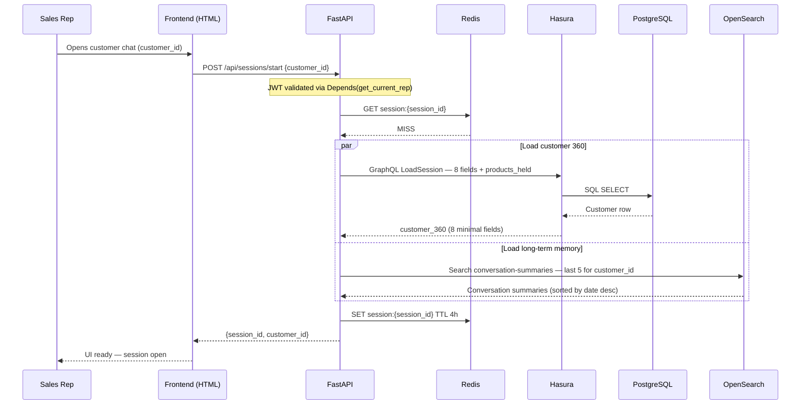
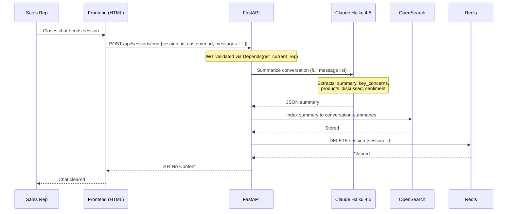
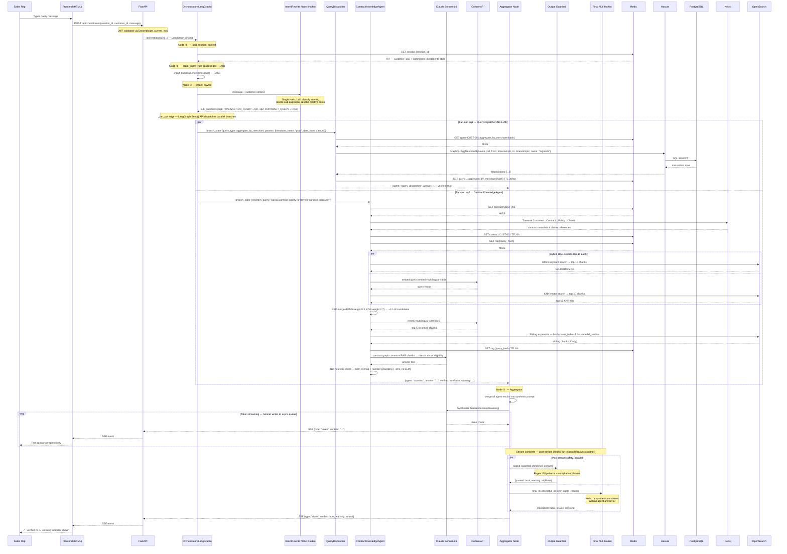
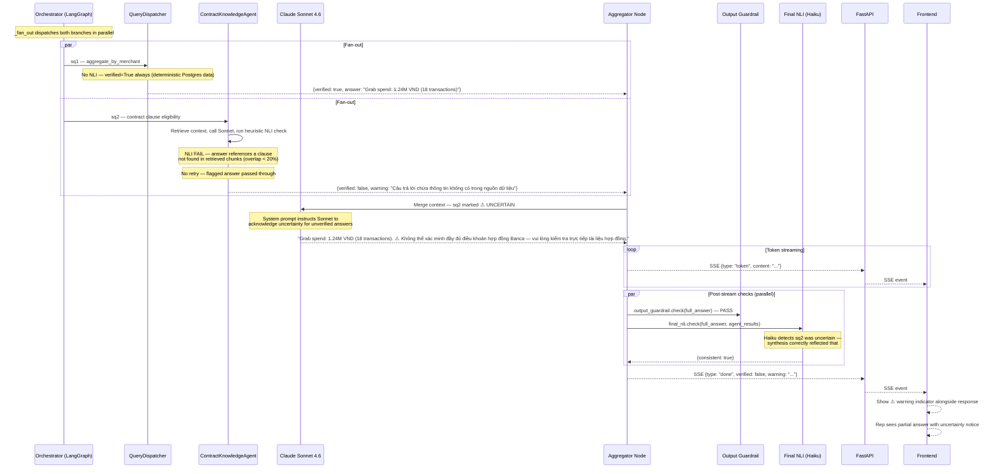
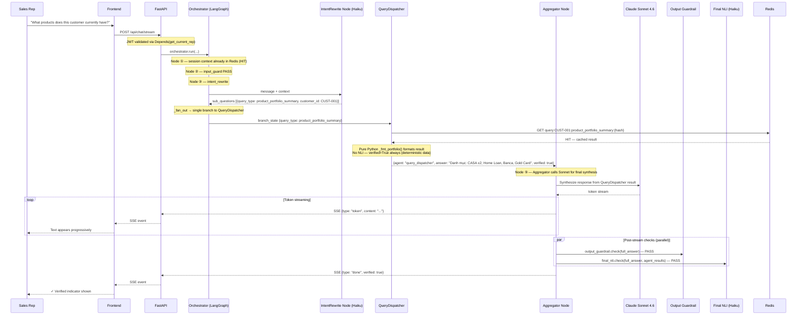

# AI FrontLine Agent — Sequence Diagrams

---

## Diagram 1: Session Start

When a sales rep opens the chat for a specific customer. Pre-warms Redis with customer 360 data and conversation summaries so the first chat message doesn't pay the load cost.

---

## Diagram 2: Session End

When the rep closes the chat. Haiku summarizes the conversation and writes to long-term memory, then clears Redis.

---

## Diagram 3: Multi-Agent Chat Query (Fan-out / Fan-in)

Main flow for a complex query requiring two agents in parallel. Example:
> *"How much has this customer spent on Grab in the last 90 days, and does his Banca contract qualify for the premium travel insurance discount?"*

This triggers `TRANSACTION_QUERY` (→ QueryDispatcher) and `CONTRACT_QUERY` (→ ContractKnowledgeAgent) in parallel.

---

## Diagram 4: NLI Failure — Partial Answer Handling

What happens when the ContractKnowledgeAgent fails the per-agent NLI check. No retry — the flagged answer passes through to the Aggregator with `verified=False` so Sonnet can acknowledge uncertainty.

---

## Diagram 5: Simple Query — QueryDispatcher Cache Hit

Fast path for a common structured query. No LLM in QueryDispatcher — pure Python formatting. Aggregator still calls Sonnet for final synthesis.

---

## Key Design Decisions

| Concern | Mechanism |
|---|---|
| Auth | JWT validated per-request via `Depends(get_current_rep)`; Hasura claims embedded for row-level security |
| Session context | Pre-warmed at `/sessions/start`; Redis cache (4h TTL) — avoids re-fetching Hasura + OpenSearch on every message |
| Query cache | Per-query Redis keys with tiered TTL (30min transactions, 6h contracts/deposits, 24h demographics) |
| Structured data | GraphQL via Hasura → Postgres — no LLM, `verified=True` always, pure Python formatting |
| RAG data | OpenSearch BM25 + KNN (top-10 each) → RRF → Cohere rerank → top-5 + sibling expansion |
| Intent routing | Haiku LLM → fan-out to 1–N agents in parallel via LangGraph `Send()` |
| Synthesis | Sonnet streams tokens to async queue → FastAPI yields SSE — no buffering delay |
| Safety | 4 layers: input regex (node ②, sync) → per-agent NLI heuristic (sync, ~1ms) → output regex + final NLI Haiku (both post-stream, parallel) |
| Observability | LangSmith `@traceable` spans: RAG·BM25/KNN/RRF/Rerank/Sibling, QueryDispatcher·Hasura, NLI·PerAgent/OutputGuardrail/Final |
