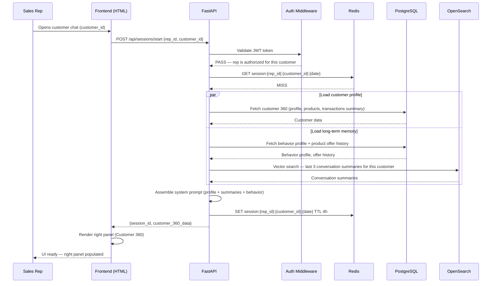
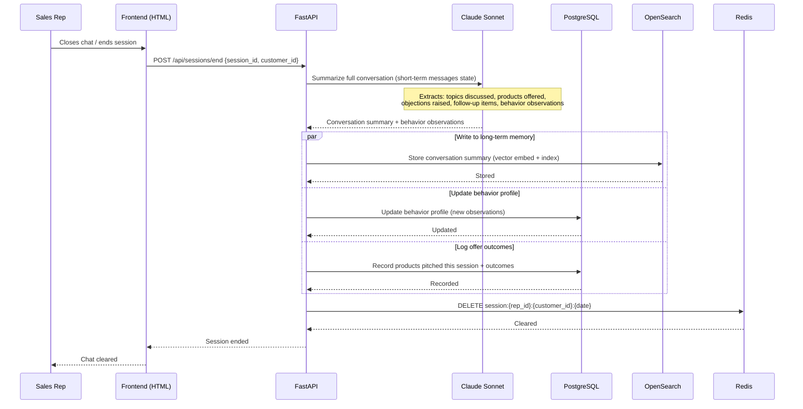
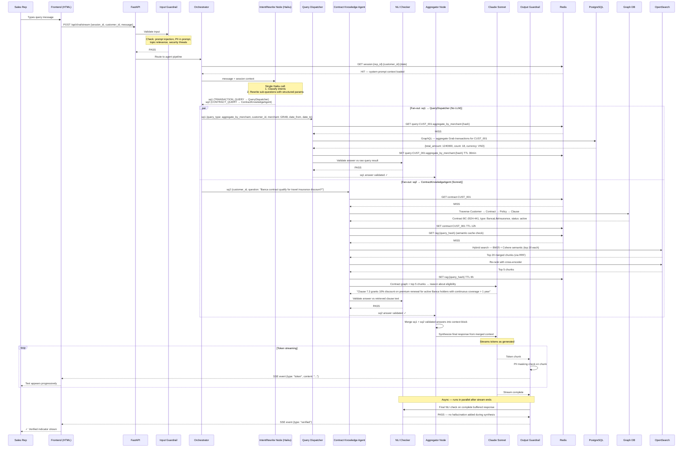
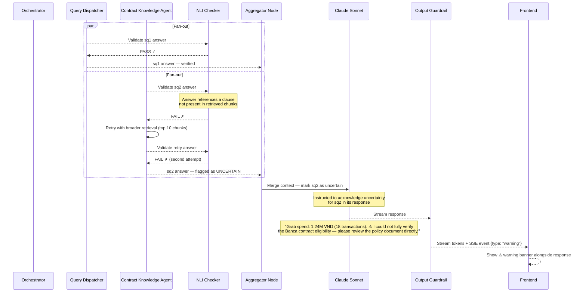
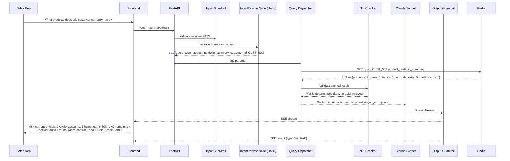

# AI FrontLine Agent — Sequence Diagrams

---

## Diagram 1: Session Start

When a sales rep opens the chat for a specific customer. Loads long-term memory and customer 360 data, assembles the system prompt, caches it for the session.

---

## Diagram 2: Session End

When the rep closes the chat or ends the session. Summarizes the conversation and writes back to long-term memory.

---

## Diagram 3: Multi-Agent Chat Query (Fan-out / Fan-in)

Main flow for a complex query requiring two agents in parallel. Example query from sales rep:
> *"How much has this customer spent on Grab in the last 90 days, and does his Banca contract qualify for the premium travel insurance discount?"*

This triggers `TRANSACTION_QUERY` (→ QueryDispatcher) and `CONTRACT_QUERY` (→ ContractKnowledgeAgent) in parallel.

---

## Diagram 4: NLI Failure — Partial Answer Handling

What happens when one sub-agent fails the NLI check. The system delivers a partial answer rather than failing the whole request.

---

## Diagram 5: Simple Query — QueryDispatcher Cache Hit

Fast path for a common structured query. No LLM involved, served from cache in milliseconds.

