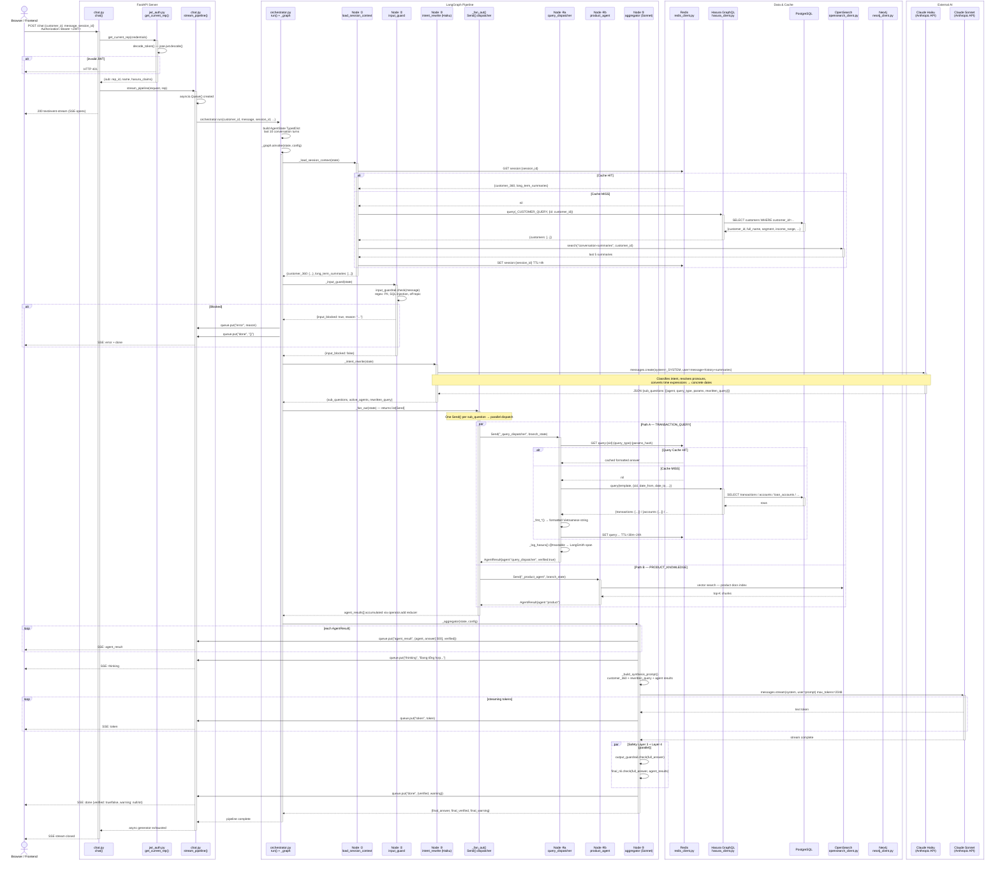

# Request Flow — AI FrontLine Agent V2

## Step-by-Step Explanation

### Step 1 — Client sends POST /chat
The browser/frontend sends `POST /chat` with a JSON body (`ChatRequest`) and a Bearer JWT in the `Authorization` header.

**Classes involved:**
- `ChatRequest` ([src/models/chat.py](src/models/chat.py)) — Pydantic model: `customer_id`, `message`, `session_id`, `conversation_history`

---

### Step 2 — JWT Authentication (Middleware)
FastAPI's dependency injection runs `get_current_rep()` before the route handler.

**Classes / functions:**
- `HTTPBearer` (FastAPI) — extracts token from header
- `get_current_rep()` ([src/middleware/jwt_auth.py](src/middleware/jwt_auth.py)) — FastAPI `Security` dependency
- `decode_token()` ([src/middleware/jwt_auth.py](src/middleware/jwt_auth.py)) — decodes & validates JWT using `jose.jwt`
- Returns a `dict` with `sub` (rep_id), `name`, Hasura claims

If invalid → HTTP 401 immediately, pipeline never starts.

---

### Step 3 — Chat Router opens SSE stream
The validated request hits the route handler. A `StreamingResponse` (Server-Sent Events) is returned immediately so the client starts receiving streamed tokens.

**Classes / functions:**
- `chat()` ([src/api/chat.py:57](src/api/chat.py)) — `@router.post("")` handler
- `stream_pipeline()` ([src/api/chat.py:20](src/api/chat.py)) — creates an `asyncio.Queue` shared between the pipeline and the SSE writer
- `StreamingResponse` (FastAPI/Starlette) — wraps the async generator
- `sse()` ([src/api/chat.py:12](src/api/chat.py)) — formats each event as `data: {...}\n\n`

Event types streamed: `thinking` · `agent_result` · `token` · `done` · `error`

---

### Step 4 — Orchestrator builds initial state and starts LangGraph
`orchestrator.run()` constructs the full `AgentState` and calls `_graph.ainvoke()`.

**Classes / functions:**
- `orchestrator.run()` ([src/agents/orchestrator.py:156](src/agents/orchestrator.py))
- `AgentState` ([src/agents/state.py](src/agents/state.py)) — `TypedDict` holding all pipeline state
- `StateGraph` (LangGraph) — compiled at module load as `_graph`
- `RunnableConfig` — carries `stream_queue` in `configurable`, LangSmith callbacks

---

### Node ① — load_session_context
**Route:** `START → load_session_context`

Loads customer context. Redis is checked first; on a miss it fetches from Hasura + OpenSearch and caches the result.

**Classes / functions:**
- `_load_session_context()` ([src/agents/orchestrator.py:25](src/agents/orchestrator.py))
- `session_store.load()` ([src/cache/session_store.py:108](src/cache/session_store.py))
- `redis_client.get/set()` ([src/cache/redis_client.py](src/cache/redis_client.py)) — key `session:{session_id}`, TTL=4h
- `hasura_client.query(_CUSTOMER_QUERY)` ([src/db/hasura_client.py:30](src/db/hasura_client.py)) — GraphQL over HTTP to Hasura → PostgreSQL
- `_load_summaries()` ([src/cache/session_store.py:56](src/cache/session_store.py)) — OpenSearch `conversation-summaries` index
- Populates `AgentState.customer_360` (8 fields) and `AgentState.long_term_summaries`

---

### Node ② — input_guard
**Route:** `load_session_context → input_guard`

Sync, zero-latency regex-based safety check. No LLM involved.

**Classes / functions:**
- `_input_guard()` ([src/agents/orchestrator.py:40](src/agents/orchestrator.py))
- `input_guardrail.check()` ([src/safety/input_guardrail.py:26](src/safety/input_guardrail.py)) — checks PII patterns, SQL injection, prompt injection, off-topic keywords

**Routing after:**
- `blocked=True` → `_block_and_done()` → emits `error` + `done` SSE → `END`
- `blocked=False` → `intent_rewrite`

---

### Node ③ — intent_rewrite (Haiku LLM)
**Route:** `input_guard → intent_rewrite`

Single Haiku call that classifies the message into one or more `sub_questions`, each targeting a specific agent. Also resolves pronouns and time expressions (e.g. "3 tháng qua" → concrete dates).

**Classes / functions:**
- `_intent_rewrite()` → `intent_rewrite.run()` ([src/agents/nodes/intent_rewrite.py:103](src/agents/nodes/intent_rewrite.py))
- `anthropic.AsyncAnthropic.messages.create()` — model: `claude-haiku-4-5`
- Returns `sub_questions[]`, `active_agents[]`, `rewritten_query`

Each `sub_question` entry specifies: `agent`, `intent`, `query_type`, `params`, `rewritten_query`

---

### Node ④ — Fan-out (parallel agent dispatch)
**Route:** `intent_rewrite → [parallel Send() calls]`

`_fan_out()` converts each `sub_question` into a LangGraph `Send()` which dispatches the corresponding agent node in parallel.

**Classes / functions:**
- `_fan_out()` ([src/agents/orchestrator.py:91](src/agents/orchestrator.py)) — returns `list[Send]`
- `Send` (LangGraph) — dispatches named node with a copy of state

#### Path A — query_dispatcher (structured data from Postgres)
Triggered when intent = `TRANSACTION_QUERY`. No LLM. Pure GraphQL template execution.

- `query_dispatcher.run()` ([src/agents/query_dispatcher.py:309](src/agents/query_dispatcher.py))
- Redis check: key `query:{customer_id}:{query_type}:{params_hash}` (tiered TTL: 30m–24h)
- On miss: `hasura_client.query(template, vars)` → GraphQL → Postgres
- Templates: `_Q_PROFILE`, `_Q_PORTFOLIO`, `_Q_AGG_CATEGORY`, `_Q_CASA`, `_Q_LOAN`, etc.
- `@traceable` LangSmith span via `_log_hasura()` ([src/agents/query_dispatcher.py:337](src/agents/query_dispatcher.py))
- Returns `AgentResult(agent="query_dispatcher", answer=formatted_str, verified=True)`

> **Salary question specifically:** maps to `query_type="profile_demographics"` → runs `_Q_PROFILE` → returns `income_range` field from `customers` table.

#### Path B — product_agent (RAG / OpenSearch)
Triggered when intent = `PRODUCT_KNOWLEDGE`.
- `product_agent.run()` ([src/agents/product_agent.py](src/agents/product_agent.py))
- RAG retriever queries OpenSearch for product documents

#### Path C — contract_agent (Neo4j graph)
Triggered when intent = `CONTRACT_QUERY`.
- `contract_agent.run()` ([src/agents/contract_agent.py](src/agents/contract_agent.py))
- Neo4j Cypher queries for contract relationship data

#### Path D — advisory_agent (NBA logic)
Triggered when intent = `ADVISORY`.
- `advisory_agent.run()` ([src/agents/advisory_agent.py](src/agents/advisory_agent.py))

All agents write into `AgentState.agent_results` (list reducer: `operator.add` — parallel safe).

---

### Node ⑤ — aggregator (Sonnet streaming synthesis)
**Route:** all agent nodes → `aggregator`

Merges all `AgentResult` entries, streams a synthesized answer via Sonnet, then runs two safety layers in parallel.

**Classes / functions:**
- `aggregator.run()` ([src/agents/nodes/aggregator.py:59](src/agents/nodes/aggregator.py))
- Emits `agent_result` SSE events for each agent result
- `_build_synthesis_prompt()` ([src/agents/nodes/aggregator.py:36](src/agents/nodes/aggregator.py)) — builds context from `customer_360` + agent results
- `anthropic.AsyncAnthropic.messages.stream()` — model: `claude-sonnet-4-6`, streams tokens
- Each token → `queue.put(("token", token))` → SSE to client
- Post-stream (parallel):
  - `output_guardrail.check()` ([src/safety/output_guardrail.py](src/safety/output_guardrail.py)) — Layer 3
  - `final_nli.check()` ([src/safety/final_nli.py](src/safety/final_nli.py)) — Layer 4 NLI verification
- Emits `done` SSE with `{verified, warning}` payload

---

### Step 5 — SSE stream completes
The `stream_pipeline()` generator in `chat.py` reads `done` or `error` from the queue and closes the response. `asyncio.Task` is awaited for clean shutdown.

---

## Sequence Diagram

---

## Key Design Decisions

| Concern | Mechanism |
|---|---|
| Auth | JWT validated per-request; Hasura claims embedded for row-level security |
| Session context | Redis cache (4h TTL) — avoids re-fetching Postgres + OpenSearch on every message |
| Query cache | Per-query Redis keys with tiered TTL (30m transactions, 24h demographics) |
| Structured data | GraphQL via Hasura → Postgres — no LLM, `verified=True` always |
| RAG data | OpenSearch vector search → product / contract docs |
| Intent routing | Haiku LLM → fan-out to 1–N agents in parallel via LangGraph `Send()` |
| Synthesis | Sonnet streams tokens directly to SSE queue — no buffering delay |
| Safety | 4 layers: input regex (sync) → output regex → NLI verification (post-stream, parallel) |
| Observability | LangSmith `@traceable` spans on Hasura calls; LangChainTracer on full graph |
